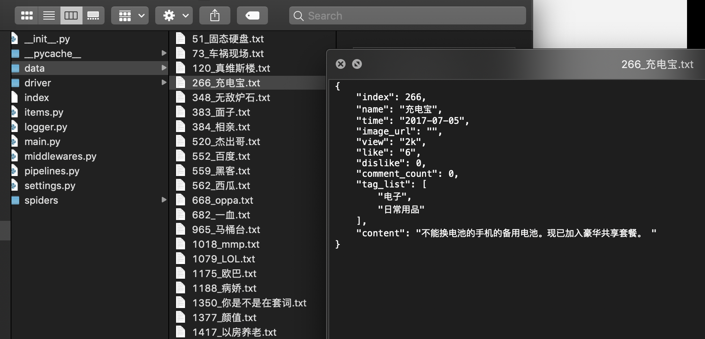
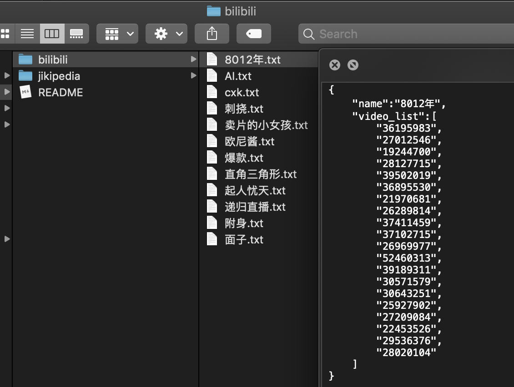

# 梗爬虫

> 基于Scrapy和Selenium的爬虫，爬取各种网络热词及其相关内容。

## 项目介绍

本项目爬取梗相关的图文、视频等内容。首先进行梗百科的爬取：

- [x] [小鸡百科](https://jikipedia.com)的所有梗的条目（存文字、图片链接）

在梗条目被爬取完毕后，根据梗的名字爬取以下内容：

- [x] [b站](https://bilibili.com)视频（av号，可以生成为外链播放器）
- [ ] [微博](https://weibo.com)（文本内容）
- [ ] [谷歌](http://google.com)图片（图片链接）

主要基于`Scrapy`实现，经过测试发现小鸡百科等网站对爬虫的封锁较严，故加入`Selenium`作为中间件进行网页访问，然而目前还是存在ip被封的可能……务必谨慎驾驶。

## 要求

### Python环境

- python==3.6.8
- Scrapy==1.5.1
- Selenium==3.141.0
- numpy==1.15.4

### 驱动

请在`driver`文件夹下放置`chromedriver`驱动。

## 运行

在`MemeCrawler`文件夹下，执行`main.py`脚本进行爬取：

```shell
$ python main.py jiki
$ python main.py bilibili
$ python main.py weibo
```

各种配置（等待时间等）详见`settings.py`。

在`logger.py`设置log层次。

## 运行截图

### Jikipedia——小鸡词典

正常情况下成功访问后，并且在随机等待（模拟阅读过程）之后，进行下滑页面、随机点赞👍的操作：


如遇不测（间隔时间较短时常会发生）可能被重定向至验证码页面，默认情况下爬虫会等待验证码消失后退出：


如果多次被封，可能导致暂时无法访问，等待一段时间即可恢复：


保存的数据为`json`格式：



### Bilibili——B站

<s>这个真不是我故意，一截就截到这个</s>


本地保存结果：

