# 梗爬虫

> 基于Scrapy和Selenium的爬虫，爬取各种网络热词及其相关内容。

### 先吃我一发安利：姚明是jojo！


## 项目介绍

本项目爬取梗相关的图文、视频等内容。首先进行梗百科的爬取：

- [x] [小鸡百科](https://jikipedia.com)的所有梗的条目（存文字、图片链接）

在梗条目被爬取完毕后，根据梗的名字爬取以下内容：

- [x] [b站](https://bilibili.com)视频（av号，可以生成为外链播放器）
- [x] [微博](https://weibo.com)（文本内容）
- [x] [谷歌](https://google.com)图片内容（需要翻墙）

爬取一定数量后，执行脚本合并数据，把每一个梗的数据保存到指定的文件夹，并对每一个词条词云关键词词云。

主要基于`Scrapy`实现，经过测试发现小鸡百科等网站对爬虫的封锁较严，故加入`Selenium`作为中间件进行网页访问，然而目前还是存在ip被封的可能……务必谨慎驾驶。

谷歌图片爬虫基于一个现成的python库`Google Images Download`完成。

## 要求

### Python环境

- python==3.6.8
- scrapy==1.5.1
- selenium==3.141.0
- numpy==1.15.4
- google-images-download==2.8.0
- jieba==0.39
- tqdm==4.32.2
- wordcloud==1.5.0

### 驱动

请在`driver`文件夹下放置`chromedriver`驱动。

### 分词、词云相关

- 在`stopwords`文件夹下放置中文停词文件`stopwords.txt`。
- 在`fonts`文件夹下放置字体文件。

默认文件已经放置，如果需要修改请在`MemeCrawler/merge.py`中修改。

## 运行

### 普通爬虫

在`MemeCrawler`文件夹下，执行`run.sh`脚本进行爬取：

```shell
$ ./run.sh [name] [time]
# name = ['jiki', 'webo', 'bilibili']
# time = frequency of checking process, int value, default = 4
```

各种配置（等待时间等）详见`settings.py`。

### 谷歌图片爬虫

在`MemeCrawler`文件夹下，执行`google.py`脚本进行爬取：

```shell
$ python google.py
```

### 合并数据

在`MemeCrawler`文件夹下，执行`merge.py`脚本进行合并数据：

```shell
$ python merge.py
```

### 注意

微博爬虫、B站爬虫、谷歌爬虫三者，均需在小鸡百科爬虫执行后才能爬取（因为是根据小鸡百科的条目进行爬取）。

## 运行截图

> **注意**：可在`settings.py`中自选是否显示Chrome浏览界面（参考配置`SHOW_WINDOW`默认不显示）

### Jikipedia——小鸡词典

正常情况下成功访问后，并且在随机等待（模拟阅读过程）之后，进行下滑页面、随机点赞👍的操作：

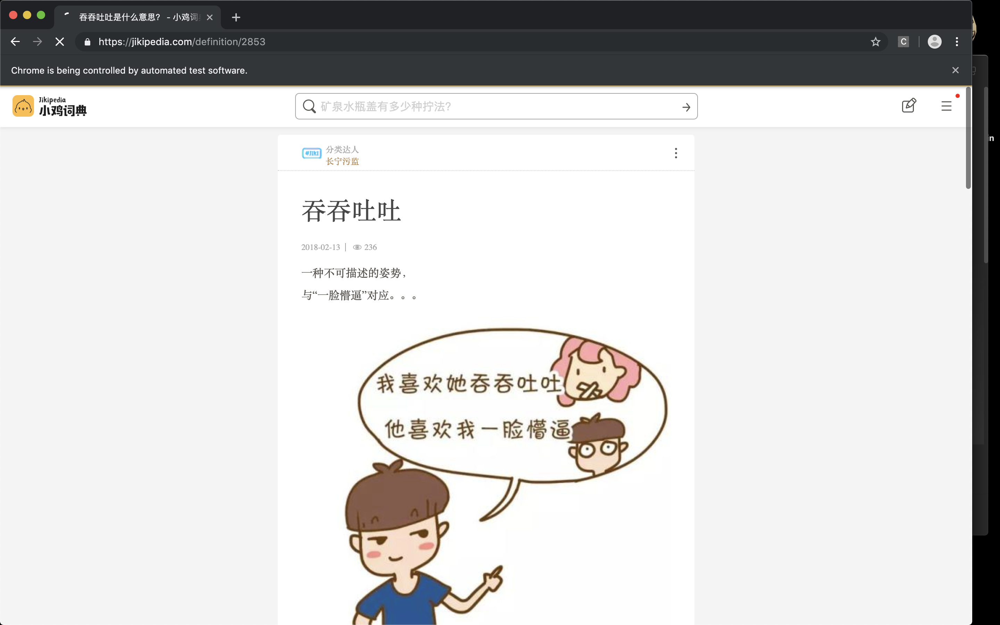

如遇不测（间隔时间较短时常会发生）可能被重定向至验证码页面，默认情况下爬虫会等待验证码消失后退出：

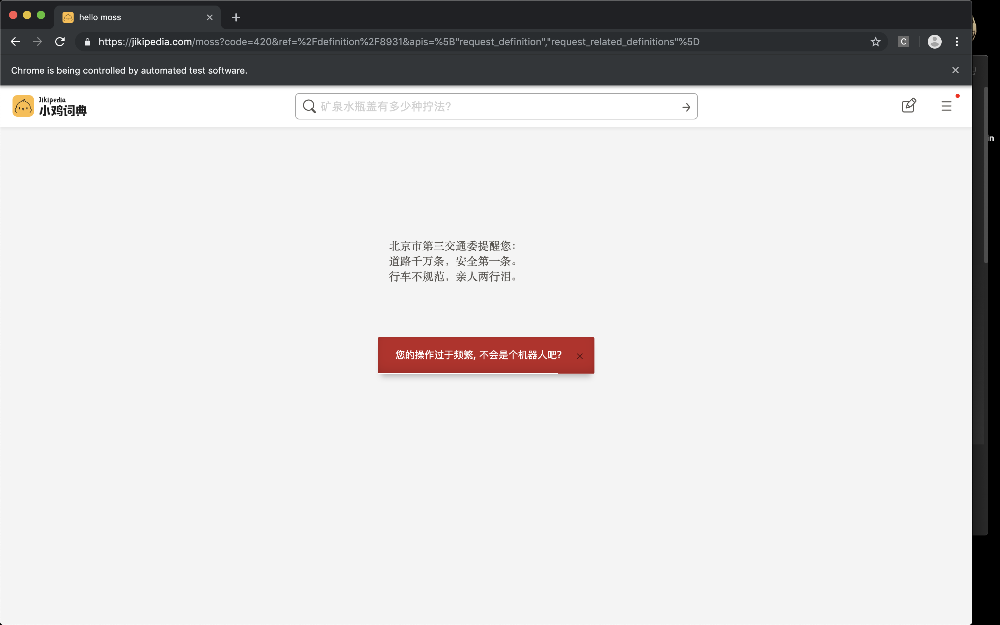

如果多次被封，可能导致暂时无法访问，等待一段时间即可恢复：

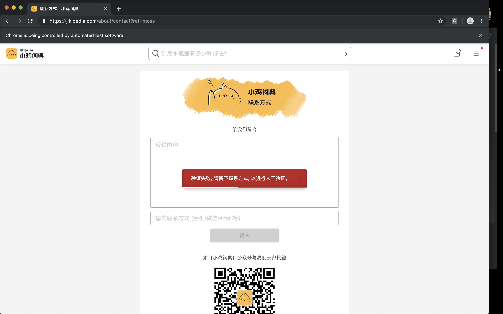

保存的数据为`json`格式：

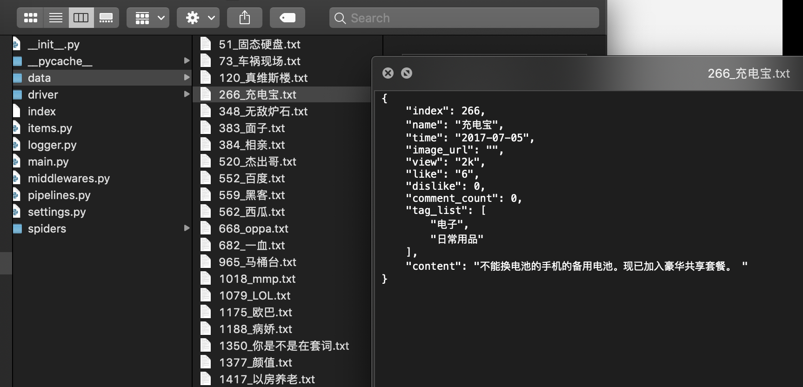

### Bilibili——B站

爬取梗相关的第一页视频搜索结果。

<s>这个图真不是我有意截的，一截就截到这个</s>

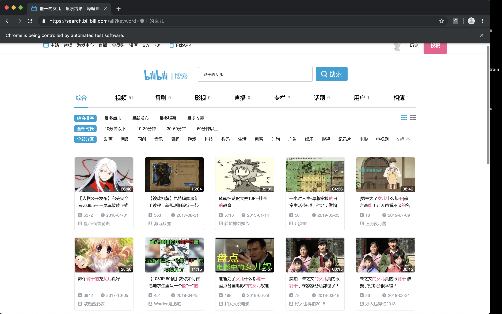

本地保存结果：

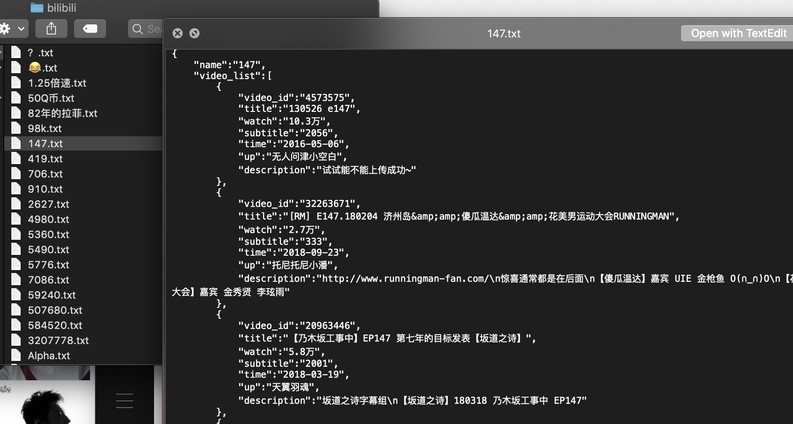

顺便一提，B站好像不会封我，真是良心哈哈

### Weibo——微博

爬取梗相关的微博第一页内容。

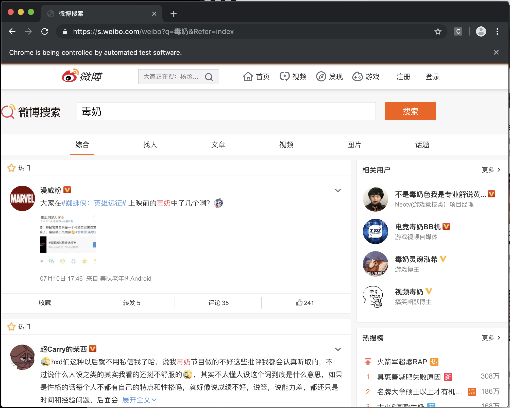

微博数据格式比较复杂，所以先保留html格式的内容……等待进一步处理。

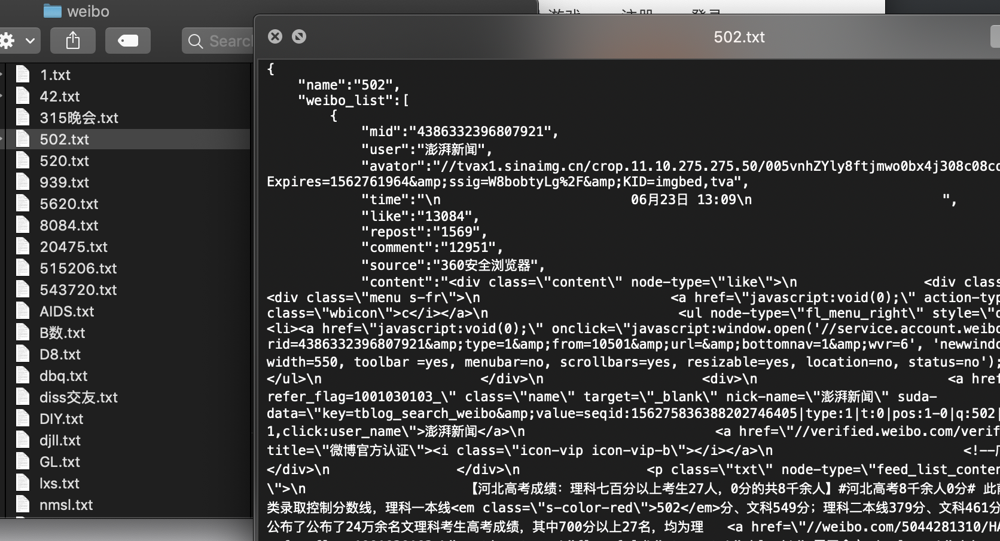

微博总是给我500响应，估计是限流操作。

### Google image——谷歌图片

**需要打开全局代理运行**。

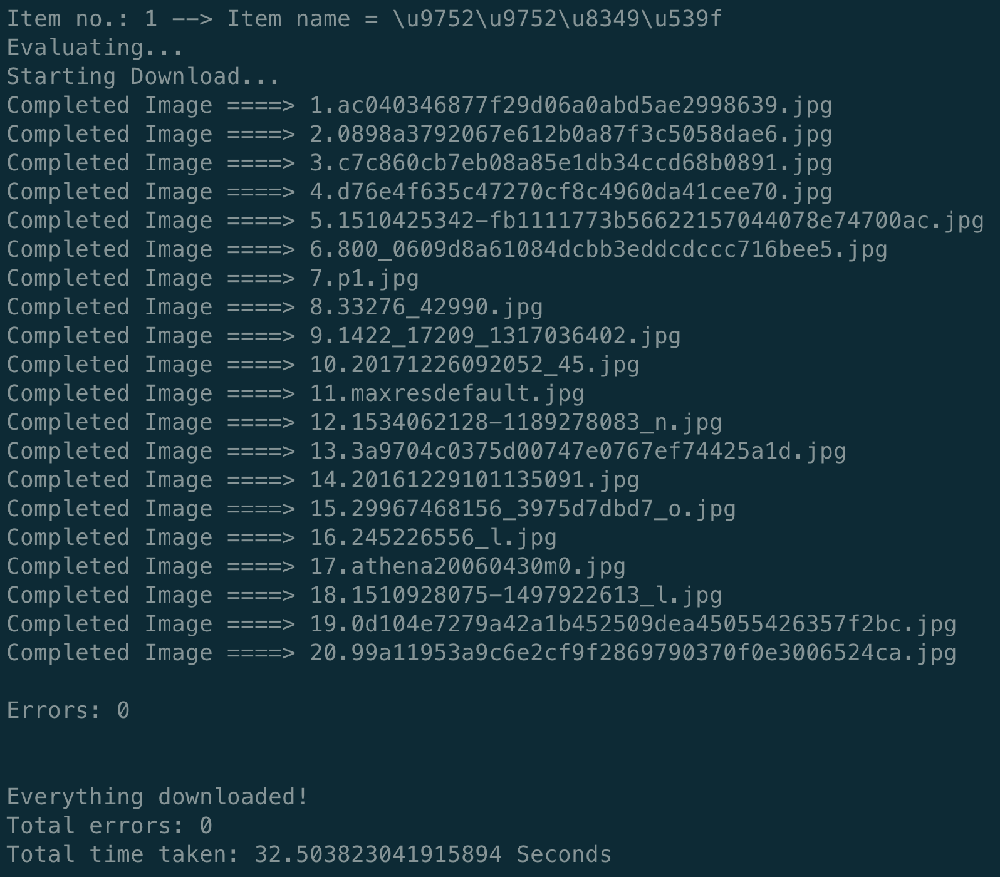

图片：默认每一个词条爬取20张，并且放在子文件夹下。

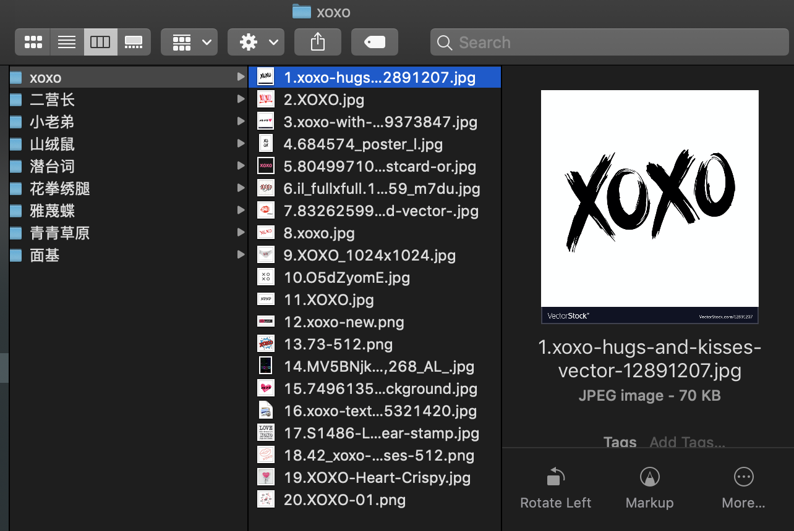

### 合并数据

⚠️注意：这个过程运行由于词云需要分词，所以会比较慢，可以自行修改`merge.py`中代码取消生成（别问为啥不做成可配置的，我懒的改了= =）

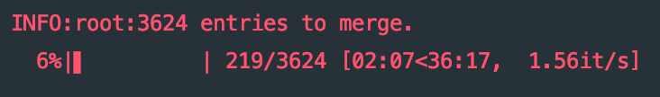

合并后数据格式：

```json
{
    "name": "test",
    "id": 0,
    "time": "2019-07-12",
    "img": "",
    "view": 1300,
    "like": 20,
    "dislike": 3,
    "tags": ["tag1", "tag2", "tag3"],
    "content": "PHP is the best programming language among the world.",
    "videoList": [
      {
        "aid": "12345678",
      	"title": "PHPHPHPHPHPHPHPHPHPHP",
      	"watch": "1万",
      	"subtitle": "123",
      	"time": "2019-07-12",
      	"up": "aki",
      	"description": "hello world."
      }
    ],
    "imageList": [
      "https://img_url"
    ],
    "weiboList": [
      {
          "user": "aki",
          "avator": "https://avator_url",
          "time": "今天12:00",
          "imgList": "https://img_url",
          "like": "1234",
          "repost": "1234",
          "source": "weibo.com",
          "content": "Life is short, I use python:)"
      }
    ]
  }
```

词云图片示例：【Github】

