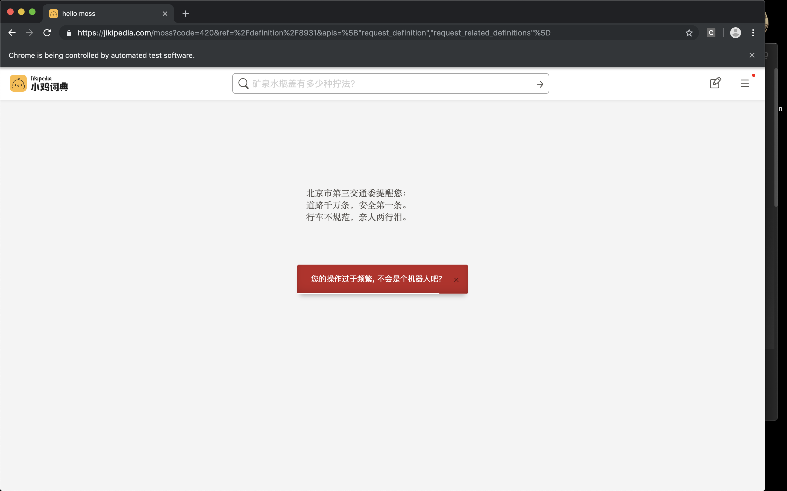

# 梗爬虫

> 基于Scrapy和Selenium的爬虫，爬取各种网络热词及其相关内容。

## 项目介绍

本爬虫尝试爬取以下内容：

- [x] [小鸡百科](https://jikipedia.com)的所有梗条目（存文字、图片链接）
- [ ] （与梗有关的）[b站](https://bilibili.com)视频（av号，可以生成为外链播放器）
- [ ] （与梗有关的）[微博](https://weibo.com)（文本内容）
- [ ] （与梗有关的）[谷歌](http://google.com)图片（图片链接）

本项目基于`Scrapy`实现，经过测试发现小鸡百科对爬虫的封锁较严，故加入`Selenium`作为中间件进行网页访问，然而目前还是存在被封的可能……谨慎驾驶TAT

## 要求

### Python环境

- python==3.6.8
- Scrapy==1.5.1
- Selenium==3.141.0
- numpy==1.15.4

### 驱动

请在`driver`文件夹下放置`chromedriver`驱动。

## 运行

执行`main.py`。

各种配置（等待时间等）详见`settings.py`。

在`logger.py`设置log层次。

## 运行截图

正常情况下可以成功访问，并且在随机等待模拟阅读之后下滑页面：

如遇不测（等待时间较短时常会发生）可能被重定向至验证码页面：

如果多次被封，可能导致暂时无法访问，等待一段时间即可恢复：

## 目前的问题

在某些情况下会停止访问，可以通过手动点击页面刷新解决。